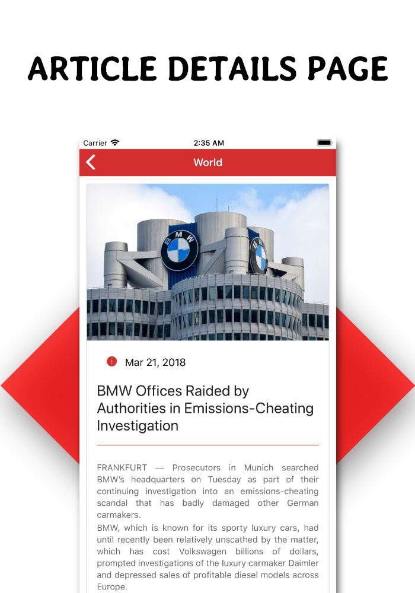

# Firenews
Full functional news app with admin panel Firebase Firestore & Ionic Framework


```
WELCOME TO IONICBUCKET. WE ARE CORDIALLY WELCOME YOU FOR CHOOSING IONICBUCKET.
THIS APPLICATION TEMPLATE BUILD IN USING WORLD FAMOUS IONIC FRAMEWORK.
```

## Screenshots
        


## Description
Firenews is full functional application which is built in Ionic Framework including admin panel with firebase database. The admin panel of this app is built with Angular 5 and Angular Material. If you are looking for newspaper, media, magazine, publishing, personal blog, business and any kind of application then FireNews will be the best choice. This is a full functional app with admin panel firestore firebase that makes your development task more easier compare with others. If you are an owner of this app then you can create a magazine news app or blog by your own easily. With your creative imagination you can also modify it into your business page, blogs, sports site, cooking site and so many.

This awesome app save your 1000% development time by using the powerful admin panel with firebase firestore. We used cloud firestore firebase for It’s flexibility, scalable database for mobile, web, and server development from Firebase and Google Cloud Platform with additional functionality, performance that support more powerful features in It’s future releases.

This awesome multipurpose news app designed with a strong sense of modern and new UI, UX concepts. The application has been created with top most open-source hybrid mobile apps development framework Ionic version 3. This awesome template app is highly customizable, user and developer friendly which holds high code quality, reflects module based project structure and many more.

The admin panel has dashboard which gives an overview of available articles and associate categories in your site. The admin panel has options of editing new and existing articles and categories. You can edit, delete and view the articles anytime from the panel. The video article option gives you the opportunity of adding youtube link directly. From admin panel you can edit about us and contact pages where the changes will be made in main application automatically. By choosing the setting option you can change your admin password also.

## TECHNOLOGIES
- Angular5
- Angular Material 2
- Firebase Firestore Cloud
- Ionic Framework V3
- SASS/SCSS

## PLATFORM SUPPORT: IOS, ANDROID
- [Google Play Store](https://play.google.com/store/apps/details?id=com.ionicbucket.firenews&hl=en)
- [Youtube](https://www.youtube.com/watch?v=rTc69z-oYFQ)
- [Documentation](http://firenews.ionicbucket.com/)
- [Admin Panel](https://ionicbucket-newsapp.firebaseapp.com/)
    - Admin Login Email: admin@gmail.com
    - Password: 123456

## REGULAR LICENSE
- Full Source Code of Application
- Full Source Code of Admin Panel

## EXTENDED LICENSE
- Full Source Code of Application
- Full Source Code of Admin Panel
- Setup & Configure Admin Panel with Hoisting Support
- Published app in App Store
- Published app in Play Store

## License

```
Copyright (c) 2019 LuckyPal IT

Permission is hereby granted, free of charge, to any person obtaining a copy
of this software and associated documentation files (the "Software"), to deal
in the Software without restriction, including without limitation the rights
to use, copy, modify, merge, publish, distribute, sublicense, and/or sell
copies of the Software, and to permit persons to whom the Software is
furnished to do so, subject to the following conditions:

The above copyright notice and this permission notice shall be included in all
copies or substantial portions of the Software.

THE SOFTWARE IS PROVIDED "AS IS", WITHOUT WARRANTY OF ANY KIND, EXPRESS OR
IMPLIED, INCLUDING BUT NOT LIMITED TO THE WARRANTIES OF MERCHANTABILITY,
FITNESS FOR A PARTICULAR PURPOSE AND NONINFRINGEMENT. IN NO EVENT SHALL THE
AUTHORS OR COPYRIGHT HOLDERS BE LIABLE FOR ANY CLAIM, DAMAGES OR OTHER
LIABILITY, WHETHER IN AN ACTION OF CONTRACT, TORT OR OTHERWISE, ARISING FROM,
OUT OF OR IN CONNECTION WITH THE SOFTWARE OR THE USE OR OTHER DEALINGS IN THE
SOFTWARE.
```
